# Laporan Proyek Machine Learning - Yoan Rifqi Candra

## Domain Proyek

## Latar Belakang
Bank Mandiri (kode saham: BMRI) merupakan salah satu bank terbesar di Indonesia yang memiliki pengaruh besar terhadap sektor keuangan nasional. Sebagai perusahaan publik yang tercatat di Bursa Efek Indonesia (BEI), harga saham BMRI mencerminkan persepsi pasar terhadap kinerja perusahaan serta kondisi makroekonomi Indonesia secara keseluruhan. Dengan tingginya volume transaksi dan fluktuasi harga yang signifikan, prediksi harga saham BMRI menjadi topik yang menarik dan penting untuk investor, analis, maupun pengambil keputusan.

Masalah utama dalam dunia investasi adalah tingginya ketidakpastian pasar. Oleh karena itu, pengembangan model prediksi berbasis machine learning yang mampu mengidentifikasi pola historis dan tren masa depan dari harga saham dapat memberikan nilai tambah besar dalam pengambilan keputusan investasi.

Menurut studi oleh Atsalakis dan Valavanis (2009), penggunaan metode kecerdasan buatan seperti Artificial Neural Networks (ANN) dan Support Vector Machine (SVM) telah terbukti mampu meningkatkan akurasi dalam memprediksi harga saham dibandingkan pendekatan statistik konvensional. Oleh karena itu, penelitian ini akan mengeksplorasi model machine learning dalam memprediksi harga saham BMRI dengan fokus pada akurasi dan keandalan prediksi.

Sumber data:
https://id.investing.com/equities/bank-mandiri-t-historical-data

Referensi:
Atsalakis, G. S., & Valavanis, K. P. (2009). Surveying stock market forecasting techniques–Part II: Soft computing methods. Expert Systems with Applications, 36(3), 5932–5941.

## Business Understanding
### Problem Statements
1. Bagaimana tren harga saham BMRI berkembang dari waktu ke waktu?
2. Kapan waktu yang tepat untuk membeli atau menjual saham BMRI?
3. Bagaimana pengaruh volume transaksi terhadap volatilitas harga saham?
4. Bagaimana memprediksi harga saham BMRI di masa depan berdasarkan data historis?

### Goals
1. Menyediakan visualisasi tren historis saham BMRI untuk memberikan wawasan tentang arah pergerakan harga dalam jangka waktu tertentu.
2. Membantu investor menentukan waktu entry dan exit berdasarkan sinyal yang diperoleh dari analisis teknikal dan tren musiman.
3. Mengevaluasi hubungan antara volume transaksi dan harga untuk memahami apakah volume dapat menjadi indikator pendukung pengambilan keputusan.
4. Membangun model prediksi harga saham menggunakan Prophet untuk menghasilkan estimasi harga saham di masa depan.

## Data Understanding
### Sumber Data
Dataset yang digunakan berasal dari data historis harga saham PT Bank Mandiri (Persero) Tbk (kode: BMRI) yang diperoleh melalui platform Investing.com Indonesia. Data tersebut mencakup informasi harian mulai dari awal tahun hingga data terbaru tahun 2025.

### Variabel-variabel pada Dataset Saham BMRI adalah sebagai berikut:
- Date : Tanggal pencatatan harga saham
- Open : Harga pembukaan pada hari tersebut
- High : Harga tertinggi dalam satu hari
- Low : Harga terendah dalam satu hari
- Close : Harga penutupan pada akhir hari
- Volume : Jumlah Saham yang diperdagang hari tersebut
- Change(%) : Selisih antara harga penutupan dan harga pembukaan pada hari tersebut

### Proses pembersihan data
- Mengubah tipe data untuk kolom Date dari object menjadi datetime
- Mengubah nama kolom agar lebih mudah diingat
- Menghilangkan tanda persen pada kolom "Change"
- Jumlah Data 1024 data dan 7 Kolom
- Tidak ada duplikasi data
- Tidak ada missing values
- Mengganti nama kolom agar lebih familiar dan mudah di proses pada tahap berikutnya, seperti 
    - Tanggal => Data
    - Terakhir => Close
    - Pembukaan => Open
    - Tertinggi => High
    - Terendah => Low
    - Vol => Volume
    - Perubahan% => Change(%)

### Exploratori Data Analisis
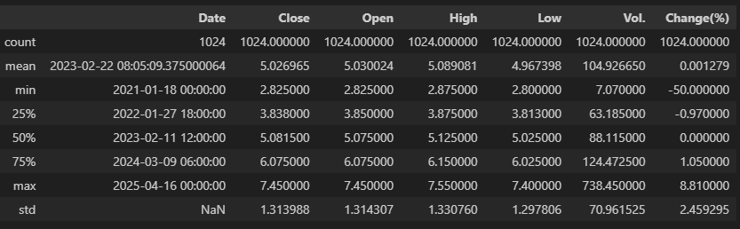

Dataset ini terdiri dari 1024 entri yang mencakup periode januari 2021 hingga April 2025, menunjukkan harga stabil dengan kisaran 5-6.15 (deviasi standar ~1.3) dan volume perdagangan bervariasi (104.93-124.47, deviasi 70.96). Namun, nilai rata-rata harga dan volume yang tidak wajar yaitu 1024 yang mengindikasikan kemungkinan kesalahan perhitungan. Perubahan harga harian relatif kecil yaitu ~50% hingga +1.05%.

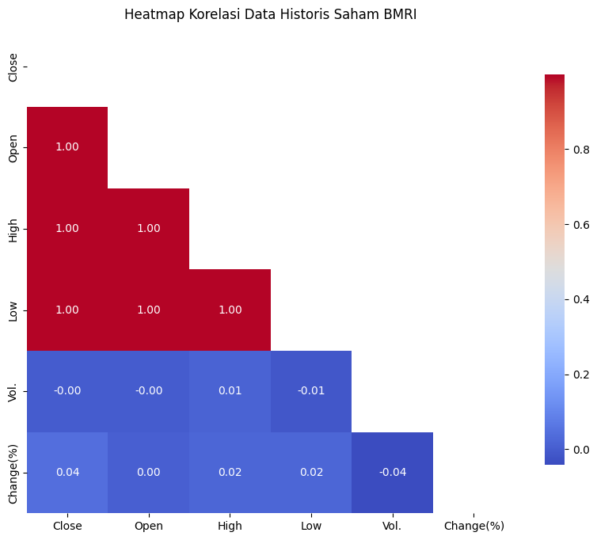

Heatmap korelasi data historis saham BMRI menunjukkan korelasi positif yang sangat kuat yaitu mendekati 1.00 antara harga Close, Open, High, dan Low yang mengindikasikan pergerakan searah yang erat antar variabel harga ini. Sebaliknya, volume perdagangan dan perubahan persentase harga memperlihatkan korelasi yang lemah dengan variabel yang lainnya, bahkan cenderung memiliki korelasi negatif yang sangat kecil sehingga menyiratkan bahwa perubahan harga dan volume perdagangan tidak memiliki hubungan linear yang signifikan.

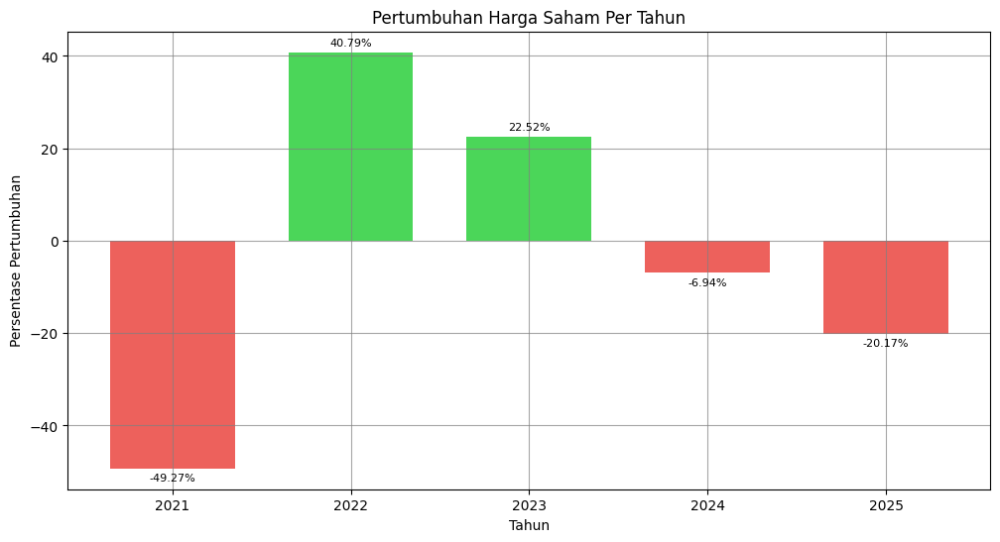

Grafik batang tersebut menggambarkan persentase pertumbuhan harga saham per tahun. Terlihat bahwa pada tahun 2021 dan 2025, saham mengalami penurunan yang signifikan, masing-masing sebesar -49.27% dan -20.17%. Sebaliknya, pertumbuhan positif tercatat pada tahun 2022 dan 2023 dengan peningkatan sebesar 40.79% dan 22.52% secara berturut-turut. Sementara itu, pada tahun 2024 terjadi penurunan yang relatif kecil sebesar -6.94%. Secara keseluruhan, pertumbuhan harga saham menunjukkan volatilitas yang cukup tinggi selama periode 2021 hingga 2025.

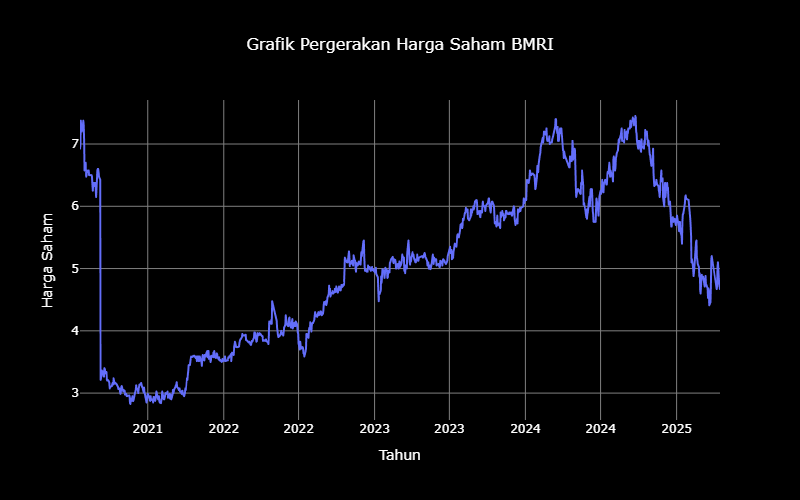

Grafik tersebut menunjukkan pergerakan saham BMRI dari tahun 2020 hingga pertengahan tahun 2025. Terlihat adanya penurunan harga yang signifikan di awal tahun 2021, diikuti dengan tren kenaikan yang fluktuatif hingga mencapai puncaknya di sekitar awal tahun 2024. Setelah mencapai titik tertinggi, harga saham mengalami penurunan yang cukup tajam hingga pertengahan 2025. Secara keseluruhan, grafik ini menggambarkan volatilitas harga saham BMRI selama periode waktu tersebut dengan fase pertumbuhan yang signifikan namun juga diikuti oleh koreksi harga yang substansial.

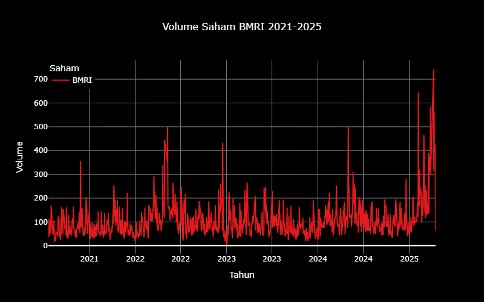

Grafik tersebut menampilkan volume perdagangan saham BMRI dari tahun 2021 hingga pertengahan tahun 2025, dimana fluktuasi volume harian terlihat cukup signifikan dengan beberapa lonjakan volume yang menonjol di berbagai periode waktu, terutama menjelang akhir tahun 2022 hingga pertengahan tahun 2024 dan peningkatan dramatis di awal tahun 2025 yang mengindikasikan adanya aktivitas perdagangan yang tinggi pada momen-momen tersebut di tengah volume perdagangan harian yang relatif lebih rendah secara umum

## Data Preparation
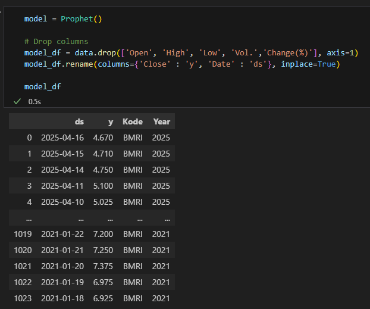

Bagian kode menunjukkan bahwa beberapa kolom ('Open', 'High', 'Low', 'Vol', 'Change(%)') sedang dihapus dari DataFrame yang bernama model_df. Kemudian, kolom yang tersisa diubah namanya menjadi 'ds' untuk kolom 'Date' dan 'y' untuk kolom 'Close' dan perubahan ini dilakukan langsung pada DataFrame. Bagian tabel di bawahnya menampilkan sebagian kecil dari Dataframe model_df setelah operasi ini dilakukan dimana terlihat kolom 'ds' yang berisi tanggal dan kolom 'y' yang berisi nilai harga. 
Tujuan proses ini dilakukan untuk menyesuaikan data dengan kebutuhan model prediksi (memilih kolom relevan dan mengubah nama agar sesuai format input model) dan menyederhanakan dataset.

## Modelling
Model Prophet merupakan sebuah model time series forecasting yang dikembangkan oleh Facebook, dirancang untuk menangani data deret waktu dengan komponen tren, musiman, dan libur secara fleksibel. Cara kerjanya berdasarkan pendekatan aditif, di mana total nilai yang diprediksi merupakan hasil penjumlahan dari komponen tren jangka panjang, pola musiman (seperti harian atau tahunan), dan noise atau error acak. Dalam kode yang digunakan, model diinisialisasi dengan parameter ``daily_seasonality=True`` dan ``yearly_seasonality='auto'``. Parameter daily_seasonality=True digunakan untuk mengaktifkan pola musiman harian, yang berguna ketika data memiliki pola berulang setiap hari, sedangkan ``yearly_seasonality='auto'`` memungkinkan Prophet secara otomatis mendeteksi apakah terdapat pola tahunan dalam data.

Setelah model diinisialisasi, proses pelatihan dilakukan dengan fungsi ``fit()`` menggunakan model_df, yaitu DataFrame yang berisi dua kolom utama: ``ds`` untuk tanggal dan ``y`` untuk nilai yang ingin diprediksi. Selanjutnya, Prophet membuat rentang waktu untuk prediksi menggunakan make_future_dataframe(periods=365), yang dalam hal ini menambahkan 365 hari ke depan untuk diramal. Setelah tanggal-tanggal tersebut dibuat, proses prediksi dilakukan dengan fungsi ``predict()``, yang menghasilkan nilai prediksi tengah (``yhat``) beserta batas bawah (``yhat_lower``) dan batas atas (``yhat_upper``) sebagai interval kepercayaan. Model ini sangat cocok digunakan dalam berbagai kebutuhan bisnis karena kemampuannya menangani data tidak lengkap, mendeteksi tren secara otomatis, dan menyederhanakan proses peramalan tanpa perlu pengetahuan statistik yang kompleks.

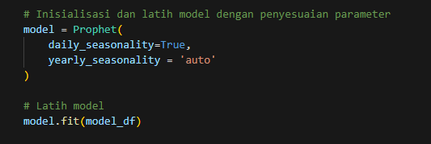

Proses inisiasi dan pelatihan model Prophet. Pertama, sebuah objek model Prophet dibuat dengan mengaktifkan seasonalitas tahunan (``yearly_seasonality='auto'``). Kemudian, model yang telah diinisialisasi ini dilatih menggunakan data yang telah dipersiapkan sebelumnya yang disimpan dalam dataframe bernama model_df. Proses pelatihan ini memungkinkan model untuk mempelajari pola temporal dalam data historis sehingga dapat digunakan untuk melakukan prediksi masa depan.

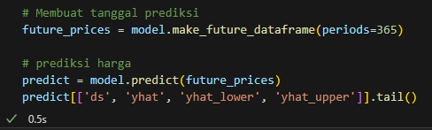

Dataframe ``futures_prices`` dibuat untuk memuat tanggal-tanggal di masa depan sebanyak 365 periode (kemungkinan hari) yang akan digunakan sebagai dasar untuk prediksi. Kemudian, fungsi ``predict()`` dari model Prophet diterapkan pada ``futures_prices`` untuk menghasilkan prediksi harga. Sebagian kecil dari hasil prediksi yang berisi kolom tanggal ``ds``, nilai prediksi ``yhat``, batas bawah interval kepercayaan ``yhat_upper``, ditampilkan. Ini memberikan gambaran prediksi harga beserta rentang ketidakpastiannya untuk periode waktu ke depan.

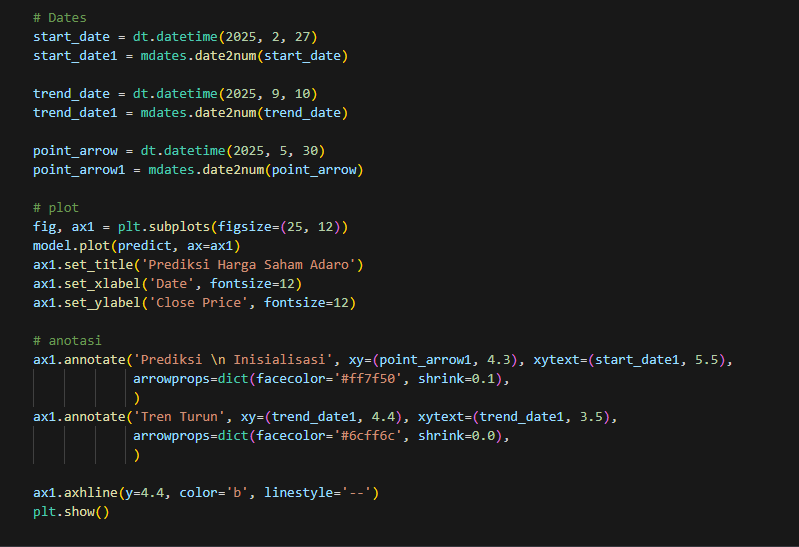

Kode ini mendefinisikan beberapa tanggal penting (``start_date``, ``trend_date``, ``point_arrow``) dalam format datetime dan numerik matplotlib. Kemudian, sebuah subplot dibuat dengan ukuran tertentu dan hasil prediksi dari model diplot dari subplot tersebut. Anotasi juga ditambahkan pada grafik untuk menyoroti titik 'Prediksi Awal Inisialisasi' dan 'Tren Turun' dengan panah dan teks yang ditempatkan pada koordinat tertentu. Terakhir, sebuah garis horizontal bewarna biru putus-putus ditambahkan pada nilai y=4.4 dan grafik keseluruhan ditampilkan menggunakan ``plt.show()``. Kode ini secara keseluruhan bertujuan untuk menyajikan hasil prediksi model secara visual dengan penambahan anotasi untuk intepretasi yang lebih mudah.

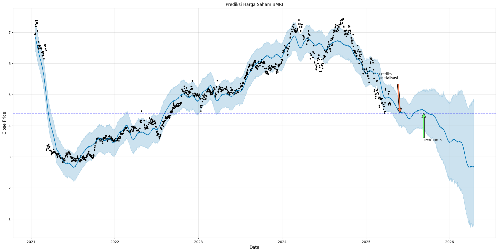

Grafik tersebut menampilkan hasil prediksi harga saham BMRI di masa depan (garis biru) beserta data historisnya (titik-titik hitam) dan interval kepercayaan (araa bewarna biru muda). Terlihat bahwa model memprediksi adanya tren penurunan harga setelah pertengahan tahun 2025, setelah sebelumnya mengalami fluktuasi dan kenaikan hingga awal tahun 2024. Garis horizontal biru putus-putus menandai level harga tertentu dan anotasi dengan panah menyoroti titik 'Prediksi Inisialisasi' serta mengindikasikan adanya 'Tren Turun' yang diprediksi oleh model. Interval kepercayaan memberikan gambaran mengenai rentang kemungkinan harga di masa depan sehingga menunjukkan tingkat ketidakpastian prediksi seiring berjalannya waktu.

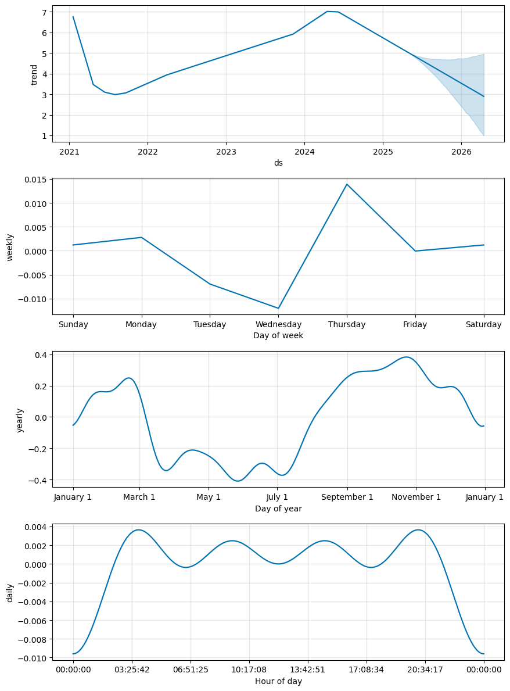

Gambar tersebut menyajikan dekomposisi model Prophet terhadap prediksi harga saham BMRI yang menampilkan tren dasar yang cenderung meningkat hingga pertengahan tahun 2024 kemudian menurun, pola mingguan yang menunjukkan variasi kecil dengan puncak hari Kamis dan lembah pada hari Rabu, pola tahunan yang memperlihatkan fluktuasi signifikan sepanjang tahun dengan kenaikan di sekitar akhir tahun dan penurunan di pertengahan tahun, serta pola harian yang menunjukkan perubahan dalam sehari namun dengan skala yang jauh lebih kecil dibandingkan pola mingguan dan tahunan. Analisis komponen-komponen ini membantu memahami faktor-faktor temporal yang mempengaruhi prediksi harga saham BMRI.

Model Prophet memiliki sejumlah kelebihan yang membuatnya populer, terutama di kalangan praktisi bisnis dan analis data non-teknis. Salah satu keunggulan utamanya adalah kemudahan penggunaan, di mana pengguna hanya perlu menyiapkan data time series dengan dua kolom utama, yaitu tanggal (``ds``) dan nilai (``y``). Prophet juga mampu menangani data yang memiliki missing values, outlier, atau perubahan tren secara tiba-tiba, tanpa memerlukan pra-pemrosesan yang kompleks. Selain itu, Prophet secara otomatis mengidentifikasi dan memodelkan komponen musiman harian, mingguan, maupun tahunan, serta dapat mengakomodasi libur atau event khusus. Karena model ini menggunakan pendekatan aditif berbasis regresi linier dengan Fourier series untuk musiman, hasilnya pun dapat dengan mudah diinterpretasikan dan dijelaskan secara visual. Prophet juga mendukung forecasting jangka panjang, serta memberikan interval prediksi (upper dan lower bound) yang berguna untuk memperkirakan ketidakpastian.

Namun, Prophet juga memiliki beberapa kekurangan. Model ini kurang cocok digunakan untuk data yang sangat kompleks atau memiliki hubungan non-linier yang kuat, seperti data dengan ketergantungan antar variabel atau yang dipengaruhi oleh faktor eksternal yang signifikan. Selain itu, Prophet tidak mengakomodasi fitur atau variabel independen tambahan secara langsung seperti pada model machine learning lainnya (misalnya XGBoost atau LSTM), meskipun dapat ditambahkan melalui ekstensi manual. Prophet juga mengasumsikan bahwa tren dan musiman bersifat aditif dan terpisah, sehingga tidak selalu efektif untuk data yang memiliki interaksi kompleks antar komponen. Di sisi performa, Prophet bisa kalah akurat dibanding model time series tradisional seperti ARIMA, SARIMA, atau model deep learning, terutama jika data tidak memiliki pola musiman yang jelas. Oleh karena itu, meskipun Prophet sangat praktis untuk pemodelan awal dan analisis eksploratif, penting untuk mempertimbangkan model alternatif jika dibutuhkan prediksi yang lebih presisi dan kompleks.

## Evaluation
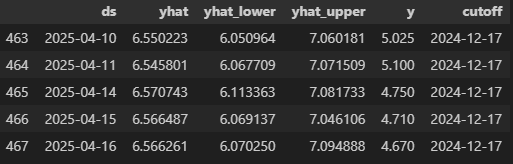

Gambar tersebut menampilkan sebagian kecil dari hasil model prediksi harga saham BMRI. Terlihat prediksi harga ``yhat`` untuk beberapa tanggal di bulan April 2025 beserta batas bawah ``yhat_lower`` dan batas atas ``yhat_upper`` dari interval kepercayaannya. Kolom y menunjukkan nilai harga saham aktual pada tanggal tersebut yang dapat dibandingkan dengan nilai prediksi. Kolom ``cutoff`` menunjukkan tanggal terakhir data yang digunakan untuk melatih model dalam proses evaluasi ini, yaitu 17 Desember 2024. Dengan membandingkan ``yhat`` dengan ``y``.

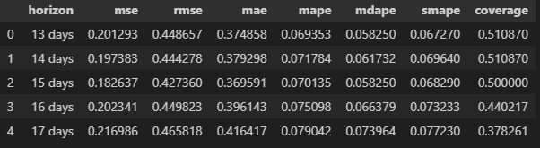

Gambar tersebut menyajikan metrik evaluasi kinerja model prediksi harga saham BMRI untuk berbagai horizon waktu, mulai dari 13 hingga 17 hari ke depan. Terlihat bahwa nilai Mean Squared Error (MSE) dan Root Mean Squared Error (RMSE) cenderung meningkat seiring dengan bertambahnya horizon prediksi yang mengindikasikan peningkatan kesalahan prediksi. Demikian pula, nilai Mean Absolute Error (MAE) dan Symmetric Mean Absolute Percentage Error (SMAPE) juga menunjukkan tren peningkatan kesalahan relatif terhadap horizon waktu. Sebaliknya, nilai coverage yang menunjukkan proporsi data aktual yang berada dalam interval prediksi yang cenderung menurun seiring dengan bertambahnya horizon yang menandakan penurunan kepercayaan model dalam merangkum nilai aktual di masa depan.

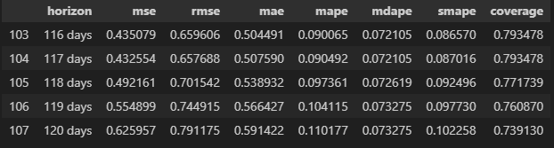

Gambar ini melanjutkan evaluasi model prediksi harga saham BMRI untuk horizon waktu yang lebih panjang, yaitu 116 hingga 120 hari ke depan. Terlihat bahwa metrik kesalahan seperti MSE, RMSE, MAE, MAPE, MDAPE, dan SMAPE secara umum menunjukkan tren peningkatan seiring dengan bertambahnya horizon prediksi yang konsisten dengan pengamatan pada horizon waktu yang lebih pendek. Hal ini mengindikasikan bahwa akurasi prediksi model cenderung menurun ketika mencoba memprediksi harga saham untuk jangka waktu yang lebih jauh ke depan. Sementara itu, nilai coverage juga menunjukkan penurunan yang bertahap yang berarti model menjadi kurang yakin dalam mencakup nilai aktual dalam interval prediksinya untuk horizon yang lebih panjang. 

### Kesimpulan
1. Bagaimana tren harga saham BMRI berkembang dari waktu ke waktu?

Jawab : Tren harga saham BMRI menunjukkan dinamika yang cukup kompleks. Pada awal grafik (2021), harga berada di level tinggi sekitar Rp7.000-an, kemudian mengalami penurunan tajam hingga sekitar Rp3.000. Setelah itu, harga mulai mengalami tren naik yang konsisten sepanjang tahun 2022 hingga pertengahan 2024. Namun, setelah pertengahan 2024, harga menunjukkan penurunan signifikan dan terus berlanjut menurun hingga prediksi ke depan (2025-2026). Ini ditandai dengan garis biru yang melandai ke bawah serta label "Tren Turun" yang kamu tandai di grafik.

2. Kapan waktu yang tepat untuk membeli atau menjual saham BMRI?

Jawab : 
Waktu membeli: Idealnya dilakukan saat harga berada di titik rendah namun mulai menunjukkan indikasi pemulihan. Dalam grafik ini, momen tersebut tampak terjadi pada pertengahan hingga akhir 2021, saat tren mulai naik. Jika melihat ke masa depan, pembelian mungkin bisa dipertimbangkan saat harga mulai stabil kembali setelah penurunan panjang — tetapi perlu dikonfirmasi dengan data aktual saat itu.

Waktu menjual: Dapat dilakukan saat harga berada dalam puncak tren naik. Misalnya, menjelang akhir 2023 atau awal 2024 ketika harga berada pada titik tertinggi sebelum mulai menurun kembali. Penjualan di masa prediksi harus berhati-hati karena grafik menunjukkan tren turun cukup panjang.

3. Bagaimana pengaruh volume transaksi terhadap volatilitas harga saham?

Jawab : 
Meskipun grafik ini tidak secara eksplisit menampilkan volume transaksi, dalam praktik pasar saham secara umum, volume transaksi memiliki korelasi kuat terhadap volatilitas harga:
- Volume tinggi seringkali menunjukkan minat pasar yang besar dan bisa menyebabkan pergerakan harga tajam, baik naik maupun turun.
- Volume rendah biasanya berkaitan dengan pergerakan harga yang lambat atau sideways.
Untuk mengukur pengaruh pastinya, kamu bisa menambahkan data volume ke dalam analisis regresi atau melihat korelasi antara volume dan perubahan harga harian.

4. Bagaimana memprediksi harga saham BMRI di masa depan berdasarkan data historis?

Jawab :
Model Prophet seperti yang kamu gunakan mampu memprediksi harga saham dengan pendekatan berbasis tren dan musiman. Berdasarkan grafik, prediksi ke depan menunjukkan tren penurunan berkelanjutan, dengan interval kepercayaan (area biru) yang semakin lebar, menandakan ketidakpastian prediksi semakin tinggi seiring waktu. Prophet memanfaatkan pola masa lalu untuk membentuk proyeksi masa depan. Namun, karena model ini tidak mempertimbangkan faktor eksternal (seperti kondisi ekonomi, sentimen pasar, atau kebijakan pemerintah), maka prediksi sebaiknya digunakan sebagai panduan awal, dan dilengkapi dengan analisis fundamental maupun teknikal lainnya.

Model Prophet yang digunakan mampu menangkap pola tren dan musiman dari pergerakan harga saham BMRI. Hal ini terlihat dari hasil dekomposisi komponen tren dan seasonalitas yang ditampilkan oleh model. Namun, semakin jauh waktu prediksi ke depan, akurasi model cenderung menurun. Ini ditunjukkan oleh meningkatnya nilai kesalahan serta melemahnya tingkat kepercayaan model.

Untuk prediksi jangka pendek, misalnya untuk beberapa hari ke depan, hasilnya lebih akurat dan bisa dijadikan pertimbangan. Sementara untuk jangka panjang seperti beberapa bulan ke depan hasil prediksi menjadi lebih tidak pasti dan yang terlihat dari rentang interval kepercayaan yang semakin lebar.
Kesimpulannya, model Prophet cukup membantu untuk melihat arah pergerakan harga saham dalam waktu dekat. Namun, hasil prediksi tetap perlu ditafsirkan dengan hati-hati terutama jika digunakan untuk investasi jangka panjang.